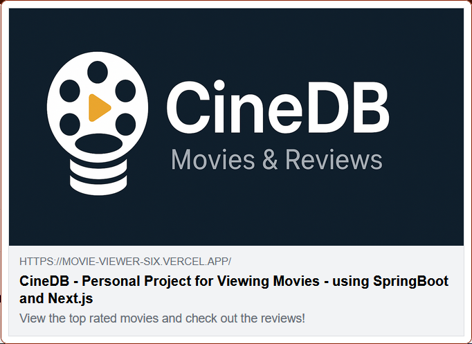

## Project Overview

Followed this [tutorial](https://www.youtube.com/watch?v=5PdEmeopJVQ&list=PLdHynhpcWIahWVxlOuWUzXBvoQ7OCgqOM&index=5) and learnt about unfamiliar technologies. 

This is a full-stack movie search application, called CineDB, built with **Spring Boot** backend and **Next.js** frontend. Users can browse movies, filter by genre, and leave reviews. To practice deployment, I used render.com and docker for the backend, and v0 to generate an intial draft of CineDB, with me making plenty of modifications to suit my use case. 

It was cool to be able to integrate the MongoDB with SpringBoot via the MongoTemplate class and MongoRepository interface.

It was my first time using Docker as well - since render.com doesn't support SpringBoot natively but supports Docker, I believe that by uploading my Docker image to Docker Hub, render simply runs the container and doesn't have to worry about the packages and technologies used since that's handled by Docker.

To make the project more SEO friendly, I made use of OpenGraph so that it looks decent when viewing through social media.

## Tech Stack

**Backend:**
- Spring Boot (Java) with MongoDB integration
- MongoDB (Atlas)
- Docker
- Render (Hosting)

**Frontend:**
- Next.js (React)
- Vercel (Hosting)

## Features

- Browse all movies from MongoDB database
- Search and filter movies by genre
- View individual movie details
- Add and view reviews for each movie
- Responsive design with Open Graph metadata for social media sharing

## Project Structure

```
movie-search/
├── moviesSearch/          # Spring Boot backend
│   ├── src/main/java/com/example/movie_app/moviesSearch/
│   │   ├── Movie.java
│   │   ├── MovieController.java
│   │   ├── MovieService.java
│   │   ├── MovieRepository.java
│   │   ├── Review.java
│   │   ├── ReviewController.java
│   │   ├── ReviewService.java
│   │   └── ReviewRepository.java
│   ├── src/main/resources/
│   │   ├── application.properties
│   │   └── .env
│   └── Dockerfile
└── frontend/              # Next.js frontend (on Vercel)
```

## Setup Instructions

### Backend (Spring Boot + Docker)

1. **Clone and navigate to backend:**
   ```bash
   cd moviesSearch
   ```

2. **Set up environment variables** in `src/main/resources/.env`:
   ```
   MONGODB=your-database-name
   MONGO_USER=your-mongo-user
   MONGO_PASSWORD=your-mongo-password
   MONGO_CLUSTER=your-cluster-url
   FRONTEND_URL=http://localhost:3000
   ```

3. **Build and run locally:**
   ```bash
   mvn clean package -DskipTests
   mvn spring-boot:run
   ```

4. **Build Docker image:**
   ```bash
   mvn clean package -DskipTests
   docker build -t yourusername/movie-search-application:latest .
   ```

5. **Push to Docker Hub:**
   ```bash
   docker login
   docker push yourusername/movie-search-application:latest
   ```

### Deployment to Render

1. Create a new Web Service on Render
2. Connect your Docker Hub repository
3. Set environment variables in Render dashboard:
   - `MONGODB`
   - `MONGO_USER`
   - `MONGO_PASSWORD`
   - `MONGO_CLUSTER`
   - `FRONTEND_URL` (your Vercel production URL)
4. Deploy

### Frontend (Next.js)

1. Set up environment variables in `.env.local`:
   ```
   NEXT_PUBLIC_API_URL=https://your-render-backend.onrender.com
   ```

2. Deploy to Vercel (connected to GitHub)

## Important Notes

- **CORS Configuration:** The backend uses `@CrossOrigin` annotation. Ensure `FRONTEND_URL` environment variable matches your frontend production URL on Render
- **MongoDB:** Uses MongoDB Atlas with connection string in `application.properties`
- **Environment Variables:** Spring Boot requires explicit configuration in `application.properties` since it doesn't natively support `.env` files (using spring-dotenv library)
- **.env files:** Never commit `.env` to GitHub - keep credentials safe

## API Endpoints

**Base URL:** `{backend-url}/api/v1`

- `GET /movies` - Get all movies
- `GET /movies/{imdbId}` - Get single movie by IMDB ID
- `POST /reviews/{movieId}` - Add review to movie
- `GET /reviews/{movieId}` - Get reviews for movie

## Troubleshooting

**CORS Errors:**
- Verify `FRONTEND_URL` is set correctly in Render environment variables
- Redeploy backend after updating environment variables

**Docker Build Issues:**
- Ensure Docker Desktop is running
- Application name must be lowercase
- Run `mvn clean package -DskipTests` before building image

**MongoDB Connection:**
- Verify connection string in `application.properties`
- Check MongoDB Atlas network access settings

## Demo




## Daily Journal - 

### 31/10/25 -

The usual monogodb database setup but this time I'll be using the mongodb compass, a gui application to create, edit, and modify my database. Created a database and created a collection inside of it. I downloaded a json file of movies and uploaded that to my collection. I was not able to get the exact json file so I am using [this](https://gist.githubusercontent.com/saniyusuf/406b843afdfb9c6a86e25753fe2761f4/raw/075b6aaba5ee43554ecd55006e5d080a8acf08fe/Film.JSON) instead. The fields that I have are sort of different than the ones from the tutorial but I'll make it work. Using the spring boot initializer, I think I select my chooses and it gives me some startup code? So in the project data we have the group where you can add your reverse domain, then the artifact, which is the name of the project. 

start.spring.io is used to generate these packages. The pom.xml is like the package.json gives me the list of all the dependencies and versions that we're using. Commented out the mongodb dependency, guess we might add it later separately? And to also get rid of the mongodb error in the logs when running the MovieSearchApplication.java file

### 1/11/25 - 

Imported the rest controller and get mapping to create api routes and as an experiment I used the "/" and "/root" that when accessed via the localhost, you get a message saying hello world! Now the mondodb needs to be connected to springboot. In the application properties file under the resources folder I add the name of the db and the mongo uri to connect to my database. I restart and boom now it works. Of course this stuff needs to be put in an env file. Since Spring Boot doesn't support env files, I had to add the package from the maven repo called spring dotenv. In the tutorial he wants to make one class for the movies and the other for the reviews but since I don't have the review, I'll be focusing on the movies instead

### 2/11/25 - 

when testing the api call on the terminal using curl did not work for me but curl.exe did, has to do with calling the native binary. The next step is to access the database through my class but for that we need the service class and repository class. 

### 5/11/25 - 

fixed a bug where I used the same attributes in terms of name as the tutorial, the JSON output gave me lots of null values. When I looked at fields of my collection, it is different from what is used in the tutorial, so I updated it accordingly to fix that issue. 

### 6/11/25 -

Added another route where you can now access the details of a single movie via the objectID but idk mahn we should not really expose that you know what I mean. To access movies without an objectID requires a manual implementation.

So apparently spring and mongo is smart enough to figure out the implementation that I am trying to do such as finding movie by imdbID and as long as you ensure that the property names are matching there is no issue.

So it turns out that for simple queries, Spring and Mongo can derive the query just based on the method name alone. pretty neat
Documentation link is [here](https://docs.spring.io/spring-data/mongodb/reference/repositories/query-keywords-reference.html#appendix.query.method.subject)

I saw that he did a lot of interesting stuff with the review class so I decided to modify my db to also have another field for reviews for each movie. Pretty sure this can be done within mongo compass itself

### 7/11/25 - 

So I was able to use Mongo Compass to add the new field which is an empty array for the reviews. For some reason AI was extremely useless, but it did give me an idea of the structure and syntax of the code. Via trial and error I was able to fix it and yea now it is working. 

I had to work backwards to add the stuff for the review class.

Read some documentation on the documentreference which allows you to create a one to many relationship (as an example) by just defining it on the class that is referencing another class??


### 8/11/25 - 

added the details for the review class and connected it to the movie class via some object reference magic. Also used the Mongo template to create custom queries to modify the database

So I found out that we use the ResponseEntity for giving us explicit control over the http response and its headers


### 13/11/25 - 

Did not add the @Autowired statement on top of the mongo template declaration in the ReviewService, causing it be null, after adding the statement the error is fixed now. 

The backend is complete, now generating the frontend through vercel I like what I am seeing so far.

As always cors error so this can be fixed by adding the @CrossOrigin annotation. Told V0 to make the necessary adjustments to handle the genre being a string of comma separated genres and not an array of genres.


### 14/11/25 - 

Redoing the prompt and trying again since I wa not specific enough the first time. Thinking of also modifying the database via the mongo compass gui.

after many prompts and iteration I got an output that I am okay with but still needs some bug fixes.

had a bug with the genre jumping each time you clicked on it. This was fixed by adding a transparent border by default when a genre is unclicked.

still having issue with cors. 


### 15/11/25 -

Fixed cors issue by fixing the url generated by v0. Also realized that the attributes defined in the interface for movie was different from the api response so I had to change all of that, lesson learnt. 

Now I realize that for public env variables in next.js they have to be prefixed with NEXT_PUBLIC in order to be used by the browser, was giving me a headache but alhamdulillah I figured it out. 

### 17/11/25 - 

Yea I won't use axios cuz just want to stick with the AI generated code for the try catch, and fetch blocks.

Some issue where some of the posters are loading but not all of them wonder why

okay some of these poster links are actually not working - so alt value should be suitable

meta tag is already present, will add the social media open graph stuff

adding a logo for the opengraph for social media, done

added the opengraph property in the metadata of next.js, so optimized for viewing on social media.

need to modify the post request cuz I am sending two key value pairs

had to debug the api post request route, just modified the body according to spec

Wanted to preview my social media open graph metadata and it looks good - viewed through an extension called OGraph Previewer

okay all features complete - now to prep for deployment

### 21/11/25 - 

Had some issues with pushing github commits so I deleted the .git folders and started over again with no issues gg

### 22/11/25 - 

So watching and reading some documentation online, one solution to deploy the springboot application is to use docker and then host that container using render. Let's see how that goes

### 25/12/25 -

Now trying to debug some issues with the review. Will use the map function and just add the index as the second argument which isn't the best practice but since the order and content of the reviews won't change, this is suitable for me

following a tutorial to create a docker image to publish to docker hub. Gotta create a build for the project before I create the dockerfile

okay following chatgpt instead inshallah this works

### 26/12/25 - 

removed some docker containers to make space and now trying to build but it's unable to find the dockerfile. Okay it's working now since I had to start up docker desktop (thx AI). I think another issue was that the name of my application had upper case, the name has to be lowercase all the time. 

okay after the build decided to run the docker run command to test and it is working alhamdulillah

next step is to publish to docker

### 27/12/25 - 

will upload my image to docker hub and deploy it on render - backend

okay backend has been deployed and is working alhamdulillah, next step is to deploy frontend on vercel

lest I forgot -  to remind myself I want to say that I also added the open graph implementation so that it looks nice on social media websites

okay deployed the frontend - had some issues with the dependency conflict, quick google search says to use the --legacy-peer-deps argument so I did that and it's working now

okay now I gotta fix the cors policy error - I believe I hardcoded the localhost ip in the backend rather than using the .env smh

### 28/12/25

Java has an interesting way of doing env variables, not used to it at all but it works so gg

Still gettting the cors error so must be something with deployment on render leet me check. Okay forgot to add the env var for the frontend url let's hope it works now inshallah.

updated env on render with the url of the frontend this should work.

Okay it is working alhamdulillah, we straight up fr


